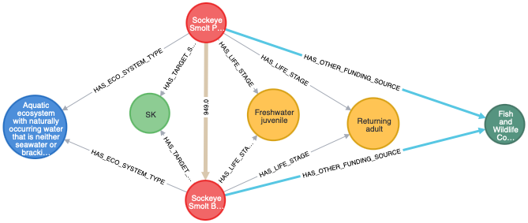

# Proof of Concept
## Pacific Salmon Knowledge Graph Initiative

### A. Overview
DFO’s Pacific Salmon Strategy (PSS) is a multi-branch initiative that seeks to transform the governance, management and assessment of salmon in the Pacific Region. Those leading this initiative, which is anticipated to begin in earnest in 2021, recognize the potential of applying Knowledge Graph (KG) (or labelled property graph, e.g. Neo4j.com) technology to assist in the assembly, storage and interpretation of complex salmon-related data and information.

One focus of the initiative is on information pertaining to current salmon rebuilding activities, building upon earlier KG work, including some that focused on southern BC Chinook salmon.

This **Proof of Concept** (PoC) is intended to demonstrate the value of KG technology as a means of helping to achieve the overall goals of the PSS by showcasing data processing procedures for assembly, cleaning, transformation (standardization), loading, and linking of data from text sources (e.g. reports, Word documents and Excel spreadsheets) into nodes and links in a Salmon Knowledge Graph.

### B. Quick-start

Note: for a more detailed installation and in-depth discussion, please see [installation.md](/installation.md).

##### 1. Prerequisite

Following software are required, please install their latest versions:
- `Docker Desktop`/`Docker Engine`
- `Docker Compose`
- `Python 3.8+`
- `git`
- `graphish` (this repository)

##### 2. Setup

Open a terminal window:

    git clone https://github.com/dfo-mpo/graphish.git
   
    cd graphish

    ./gather_neo4j_plugins.sh

    docker-compose pull 

    docker-compose up -d nlp neo4j show

Then in a browser (Chrome, Firefox, Safari):

    http://localhost:7474/

`Neo4j` will ask you to login.

 Use `neo4j` for `username`, and `pskgi` for `password`. 
 
 Once logged in, you can start the interactive slideshow by typing the following into the query box:

    :play http://localhost:8001/html/parr_show_v2.html

And use the `pin` to pin up the panel so that the slide deck stay there during the whole show.

Note:
- all docker `nlp` `show` already built and can be pulled from https://hub.docker.com/orgs/dfompo/repositories
- in the instructions above, `localhost` is used as a hostname, you should replace it with the appropriate hostname

### C. Interactive slideshow:

**How-to use the interactive slideshow**

An interactive slideshow contains `runable` Cypher queries. You don't have to type anything. The queries are already included in the slide deck. Whenever you see a shaded rectange, it's a query. You only need to click on it to (automatically) copying its content into the query box. After that, clicking the blue button on the right side of the query box runs the query. If you have pinned the slide deck (see above), then the query result always written below the slide deck.

**The interactive slideshow consists of two parts:**
- the first one attempts to discuss a few questions that are time comsuming to answer without capabilities to deal with connected data represented by graphs. This part can be run, experiment with, or refactor for new needs.
- the second part provides detailed queries, that can be run by a few click to (re)populate the database. Normally this has to be done once and never need to be touched again.

#### Part 1 - 5 Questions

In this section 5 questions are addressed:

- Q1: Where are the projects? What are the nearest popoluated places? How far are they from each other? How project sites from the same project can be viewed? How this view is change over time?
  Focus: Panoramic view of the projects in geographical context, with time-based snapshot.
  Graph technology: shortest path and traversal filtering

- Q2: Who are the lead organizations? Are they local entities? How can they be measured based on what they have done?
  Focus: Overview of the roles and relationships of lead organizations to projects, setting up proven track record.
  Graph technology: tree construction and data aggregation

- Q3: Are there similar projects aiming at same set of target species and life stages, with same or different fundding sources?
  Focus: Measure similarities based on common objectives, closer look.
  Graph technology: set intersection similarity with geographical spatial distance constraint

- Q4: At which watershed certain species at certain life stage have not been benefitted from the projects?
  Focus: Looking for what have not been there.
  Graph technology: tree construction and traversal filtering

- Q5: Given a set of parameters for a location, which lead organization and partners could be selected for such project execution?
  Focus: Multi-goal objective based on learned past experience. 
  Graph technology: minimal spanning tree.

**Topic 1 - Panoramic view - All projects in a single view**

The geographical entities of British Columbia are arranged into a large tree structure. 

The query below constructs a graph by:
- locating the nearest populated place (from Geonames data) for each project,
- tracing the tree branches connecting the places to the root

The result is a subtree of the British Columbia geographical tree, with the projects as leaves, each connected to the nearest geo-location. The distance, rounded to the nearest kilometer, is displayed on the relationship between the project and its nearest location.

    MATCH (province:GEO_LOCATION {name: "British Columbia"})
    WITH province
        MATCH (project:PROJECT)-[rel:PLACE_NEARBY]->(place)
    WITH province, project, rel, place
        MATCH path=shortestPath((place)-[:WITH_IN*1..]-(province))
    RETURN province, project, rel, place, path;

**Topic 1 - Yearly snapshot - Choose a year and view the picture**

The all-project graph contains all projects over the years. Here how's you can choose the 2016 snapshot.

First click on the query below in order to move its content into the query editor. Change the year to one of 2016, 2017, ..., 2022 and then run it by clicking on the blue arrow on the right of the query editor to set the year parameter.

    :param year => 2016;

Now the year parameter is set, you can rerun the query to view only projects in 2016.

    MATCH (province:GEO_LOCATION {name: "British Columbia"})
    WITH province
    MATCH (project:PROJECT)-[rel:PLACE_NEARBY]->(place)
        WHERE project.project_duration IS NOT NULL 
        AND apoc.meta.cypher.type(project.project_duration) = 'LIST OF INTEGER'
        AND project.project_duration[0] <= $year
        AND $year <= project.project_duration[1]
    WITH province, project, rel, place
        MATCH path=shortestPath((place)-[:WITH_IN*1..]-(province))
    RETURN province, project, rel, place, path;

You can reset the year parameter by choosing the year param setting again and then run the project query again for other yearly snapshot. Below are a few years from 2017-2020

Below is snapshot 2017.

Below is snapshot 2018.

Below is snapshot 2019.

Below is snapshot 2020.

Below is snapshot 2021.

**Topic 2 - Learned insights - All lead organizations in one view**

Since the projects are more likely watershed specific, so it is also very likely that the project lead organizations more or less local ones. The diagram shows that there are only a few who works for projects in different watersheds.

    MATCH (project:PROJECT)-[rel1]-(organization:LEAD_ORGANIZATION)
    WITH  project, rel1, organization
        OPTIONAL MATCH (project)-[rel2:HAS_WATERSHED]-(watershed)
    RETURN project, rel1, organization, rel2, watershed

**Topic 2 - Learned insights - What did the highest sum of total costs of completed projects by a lead organization bring?**

Using traversal aggregation, we look at all projects indicated as completed by each lead organization. Furthermore, target species and life stages of all completed project are combined to provide a full picture. Note that it can be seen that how many projects contribute to a target species or life stage.

An interesting feature here is that the result is created as a partital virtual graph. Some nodes and edges are created only for this view, they make the view much simple but still comprehensive.

    MATCH (org:LEAD_ORGANIZATION)-[:HAS_LEAD_ORGANIZATION]-(project:PROJECT)-[:HAS_PROJECT_PHASE]-(:PROJECT_PHASE {uid: "Completed"})
    WITH DISTINCT(project.pid) AS pid, org, COLLECT(project) AS project_list
    WITH org, COLLECT(project_list[0]) AS project_list
    MATCH (org)-[:HAS_LEAD_ORGANIZATION]-(project)-[:HAS_LIFE_STAGE]-(stg)
        WHERE project IN project_list
    WITH DISTINCT(stg) AS stg, org, project_list, COUNT(DISTINCT(project)) AS n_of_p
        CALL apoc.create.vRelationship(org, 'WITH_LIFE_STAGE', {projects: n_of_p}, stg) YIELD rel
    WITH org, project_list, COLLECT([stg, rel]) AS stg_list
        MATCH (org)-[:HAS_LEAD_ORGANIZATION]-(project)-[:HAS_TARGET_SPECIES]-(species)
        WHERE project IN project_list AND EXISTS(species.name)
    WITH DISTINCT(species) AS species, org, project_list, stg_list, COUNT(DISTINCT(project)) AS n_of_p
        CALL apoc.create.vRelationship(org, 'WITH_TARGET_SPECIES', {projects: n_of_p}, species) YIELD rel
    WITH org, project_list, stg_list, COLLECT([species, rel]) AS species_list
        MATCH (org)-[:HAS_LEAD_ORGANIZATION]-(project)-[:HAS_WATERSHED]-(wsh)
        WHERE project IN project_list
    WITH DISTINCT(wsh) AS wsh, org, project_list, stg_list, species_list, COUNT(DISTINCT(project)) AS n_of_p
        CALL apoc.create.vRelationship(org, 'WITH_WATERSHED', {projects: n_of_p}, wsh) YIELD rel
    WITH DISTINCT(org) AS org, project_list, stg_list, species_list, COLLECT([wsh, rel]) AS wsh_list
    WITH org, stg_list, species_list, wsh_list, apoc.coll.sum([project IN project_list | CASE project.the_total_cost_of_the_project IS NOT NULL WHEN TRUE THEN project.the_total_cost_of_the_project ELSE 0 END]) AS total_cost
        CALL apoc.create.vNode(['PROJECT_COST'],{cost: total_cost}) YIELD node AS cost_node
    CALL apoc.create.vRelationship(org, 'WITH_COST', {}, cost_node) YIELD rel
    WITH org, stg_list, species_list, wsh_list, cost_node, rel ORDER BY total_cost DESC 
    RETURN org, stg_list, species_list, wsh_list, cost_node, rel LIMIT 1;

**Topic 3 - Clusters of nearby projects funded by same sources**

In this topic, first we look for all projects that aim at the same tager species AND same life stages and are very near to each other (within 2000 meters)). They could be funded by the same set of organizations or sources.

The query below shows 1 cluster of different nearby projects with same objectives having funded by the same G&C funding source.

    MATCH (project:PROJECT)
    WITH DISTINCT(project.pid) AS pid, COLLECT(project) AS project_list
    WITH COLLECT(project_list[0]) AS project_list
        MATCH (first_project)-[r1:HAS_LIFE_STAGE]-(stage)-[r2:HAS_LIFE_STAGE]-(second_project)-[r3:HAS_TARGET_SPECIES]-(species)-[r4:HAS_TARGET_SPECIES]-(first_project)
            WHERE first_project <> second_project 
        AND first_project IN project_list 
        AND second_project IN project_list 
        AND DISTANCE(first_project.location, second_project.location) < 2000
    WITH DISTINCT([first_project, second_project]) AS pair, COLLECT([r1, stage, r2, r3, species, r4]) AS objective_path
    WITH pair[0] AS first_project, pair[1] AS second_project, objective_path
        MATCH (first_project)-[r1:HAS_GC_FUNDING_SOURCE]-(source)-[r2:HAS_GC_FUNDING_SOURCE]-(second_project)
    WITH first_project, second_project, objective_path, COLLECT([r1, source, r2]) AS funding_path
        CALL apoc.create.vRelationship(first_project, 'DISTANCE', {d: apoc.math.round(DISTANCE(first_project.location, second_project.location), 0, 'FLOOR')}, second_project) YIELD rel
    RETURN first_project, second_project, objective_path, funding_path, rel;

The query below shows 4 clusters of different nearby projects with same objectives having other funding sources the same set of organizations.

    MATCH (project:PROJECT)
    WITH DISTINCT(project.pid) AS pid, COLLECT(project) AS project_list
    WITH COLLECT(project_list[0]) AS project_list
        MATCH (first_project)-[r1:HAS_LIFE_STAGE]-(stage)-[r2:HAS_LIFE_STAGE]-(second_project)-[r3:HAS_TARGET_SPECIES]-(species)-[r4:HAS_TARGET_SPECIES]-(first_project)
            WHERE first_project <> second_project 
        AND first_project IN project_list 
        AND second_project IN project_list 
        AND DISTANCE(first_project.location, second_project.location) < 2000
    WITH DISTINCT([first_project, second_project]) AS pair, COLLECT([r1, stage, r2, r3, species, r4]) AS objective_path
    WITH pair[0] AS first_project, pair[1] AS second_project, objective_path
        MATCH (first_project)-[r1:HAS_OTHER_FUNDING_SOURCE]-(source)-[r2:HAS_OTHER_FUNDING_SOURCE]-(second_project)
    WITH first_project, second_project, objective_path, COLLECT([r1, source, r2]) AS funding_path
        CALL apoc.create.vRelationship(first_project, 'DISTANCE', {d: apoc.math.round(DISTANCE(first_project.location, second_project.location), 0, 'FLOOR')}, second_project) YIELD rel
    RETURN first_project, second_project, objective_path, funding_path, rel;

**Topic 3 - Closer look at a pairs of projects**

A closer look - at a pair of projects (16-HPAC-00395 and COA-F18-F-2396\n(Ecocat ID 54487)) can reveal more details.

    MATCH (first_project:PROJECT {pid: "16-HPAC-00395"})-[r1:HAS_LIFE_STAGE]-(stage)-[r2:HAS_LIFE_STAGE]-(second_project:PROJECT {pid: "COA-F18-F-2396\n(Ecocat ID 54487)"})-[r3:HAS_TARGET_SPECIES]-(species)-[r4:HAS_TARGET_SPECIES]-(first_project)
    WITH DISTINCT([first_project, second_project]) AS pair, COLLECT([r1, stage, r2, r3, species, r4]) AS objective_path
    WITH pair[0] AS first_project, pair[1] AS second_project, objective_path
        MATCH (first_project)-[r1:HAS_OTHER_FUNDING_SOURCE]-(source)-[r2:HAS_OTHER_FUNDING_SOURCE]-(second_project), (first_project)-[r3:HAS_ECO_SYSTEM_TYPE]-(eco)-[r4:HAS_ECO_SYSTEM_TYPE]-(second_project)
    WITH first_project, second_project, objective_path, COLLECT([r1, source, r2]) AS funding_path, COLLECT([r3, eco, r4]) AS eco_path
        CALL apoc.create.vRelationship(first_project, 'DISTANCE', {d: apoc.math.round(DISTANCE(first_project.location, second_project.location), 0, 'FLOOR')}, second_project) YIELD rel
    RETURN first_project, second_project, objective_path, funding_path, eco_path, rel;

Another closer look - at a pair of projects (16-HPAC-00395 and COA-F18-F-2396\n(Ecocat ID 54487)) can reveal more details.

    MATCH (first_project:PROJECT {pid: "COA-F18-F-2362\n(Ecocat ID 54480)"})-[r1:HAS_LIFE_STAGE]-(stage)-[r2:HAS_LIFE_STAGE]-(second_project:PROJECT {pid: "COA-F18-F-2485\n(Ecocat ID 55505)"})-[r3:HAS_TARGET_SPECIES]-(species)-[r4:HAS_TARGET_SPECIES]-(first_project)
    WITH DISTINCT([first_project, second_project]) AS pair, COLLECT([r1, stage, r2, r3, species, r4]) AS objective_path
    WITH pair[0] AS first_project, pair[1] AS second_project, objective_path
        MATCH (first_project)-[r1:HAS_OTHER_FUNDING_SOURCE]-(source)-[r2:HAS_OTHER_FUNDING_SOURCE]-(second_project), (first_project)-[r3:HAS_ECO_SYSTEM_TYPE]-(eco)-[r4:HAS_ECO_SYSTEM_TYPE]-(second_project)
    WITH first_project, second_project, objective_path, COLLECT([r1, source, r2]) AS funding_path, COLLECT([r3, eco, r4]) AS eco_path
        CALL apoc.create.vRelationship(first_project, 'DISTANCE', {d: apoc.math.round(DISTANCE(first_project.location, second_project.location), 0, 'FLOOR')}, second_project) YIELD rel
    RETURN first_project, second_project, objective_path, funding_path, eco_path, rel;

**Topic 4 - Looking for what is not there**

The query aims to analyze what watershed have projects for a number of life stages but not all of them. The result is to reveal what number of projects support different target species and life stages. Obviously what are not on the display, are not supported by the projects.

    MATCH (stage:LIFE_STAGE)
        WHERE stage.name <> 'All stages'
    WITH COLLECT(DISTINCT(stage)) AS all_stage_list
        MATCH (watershed:WATERSHED)
    WITH all_stage_list, watershed
        MATCH (watershed)-[:HAS_WATERSHED]-(project:PROJECT)-[:HAS_LIFE_STAGE]-(stage)
    WITH watershed, all_stage_list, COLLECT(DISTINCT(stage)) AS stage_list, COUNT(DISTINCT(project)) AS n_of_p
    WITH watershed, all_stage_list, stage_list, n_of_p
        WHERE SIZE(stage_list) < SIZE(all_stage_list)
    WITH watershed, stage_list ORDER BY SIZE(stage_list)/SIZE(all_stage_list) DESC, n_of_p DESC
    WITH watershed
        MATCH (watershed)-[:HAS_WATERSHED]-(project:PROJECT)-[:HAS_LIFE_STAGE]-(stage)
    WITH DISTINCT(stage) AS stage, watershed, COUNT(DISTINCT(project)) AS n_of_p
        CALL apoc.create.vRelationship(watershed, 'WITH_LIFE_STAGE', {projects: n_of_p}, stage) YIELD rel
    WITH watershed, COLLECT([stage, rel]) AS objective_path_1
        MATCH (watershed)-[:HAS_WATERSHED]-(project:PROJECT)-[:HAS_TARGET_SPECIES]-(species)
            WHERE EXISTS(species.name)
    WITH DISTINCT(species) AS species, watershed, objective_path_1, COUNT(DISTINCT(project)) AS n_of_p
        CALL apoc.create.vRelationship(watershed, 'WITH_TARGET_SPECIES', {projects: n_of_p}, species) YIELD rel
    RETURN watershed, objective_path_1, COLLECT([species, rel]) AS objective_path_2;

**Topic 5 - Matching multiple objectives**

What lead organization would be suitable to implement a project:
- at Lower Fraser watershed
- supporting freshwater juvenile and returning adult
- aiming at target species of Sockeye Salmon, Chinook Salmon, and Salish Sucker
- have been completed projects with total value at least $50,000

Turned out, there might not be a single of them satifying all conditions, but three candidates are nearly good.

    MATCH (project:PROJECT)-[:HAS_PROJECT_PHASE]-(:PROJECT_PHASE {uid: "Completed"})
    WITH DISTINCT(project.pid) AS pid, COLLECT(project) AS project_list
    WITH COLLECT(project_list[0]) AS project_list
        MATCH (org)-[:HAS_LEAD_ORGANIZATION]-(project)-[:HAS_LIFE_STAGE]-(stage:LIFE_STAGE)
            WHERE project IN project_list AND stage.uid IN ["Freshwater juvenile", "Returning adult"]
    WITH DISTINCT(stage) AS stage, org, project_list, COUNT(DISTINCT(project)) AS count
        CALL apoc.create.vRelationship(org, 'WITH_LIFE_STAGE', {projects: count}, stage) YIELD rel
    WITH org, project_list, COLLECT([stage, rel]) AS stage_list
        MATCH (org)-[:HAS_LEAD_ORGANIZATION]-(project)-[:HAS_TARGET_SPECIES]-(species:TARGET_SPECIES)
            WHERE project IN project_list AND EXISTS(species.name) AND species.uid IN ["SK", "CH", "SSU"]
    WITH DISTINCT(species) AS species, org, project_list, stage_list, COUNT(DISTINCT(project)) AS count
        CALL apoc.create.vRelationship(org, 'WITH_TARGET_SPECIES', {projects: count}, species) YIELD rel
    WITH org, project_list, stage_list, COLLECT([species, rel]) AS species_list
        MATCH (org)-[:HAS_LEAD_ORGANIZATION]-(project)-[:HAS_WATERSHED]-(watershed:WATERSHED {uid: "Lower Fraser"})
            WHERE project IN project_list
    WITH DISTINCT(watershed) AS watershed, org, project_list, stage_list, species_list, COUNT(DISTINCT(project)) AS count
        CALL apoc.create.vRelationship(org, 'WITH_WATERSHED', {projects: count}, watershed) YIELD rel
    WITH DISTINCT(org) AS org, project_list, stage_list, species_list, COLLECT([watershed, rel]) AS watershed_list
        MATCH (org)-[:HAS_LEAD_ORGANIZATION]-(project)
            WHERE project IN project_list
    WITH org, stage_list, species_list, watershed_list, SUM(CASE project.the_total_cost_of_the_project IS NOT NULL WHEN TRUE THEN project.the_total_cost_of_the_project ELSE 0 END) AS total_cost
    WITH org, stage_list, species_list, watershed_list, total_cost
        WHERE total_cost > 50000
    WITH org, stage_list, species_list, watershed_list, total_cost
        CALL apoc.create.vNode(['PROJECT_COST'],{value: total_cost}) YIELD node AS cost
        CALL apoc.create.vRelationship(org, 'WITH_COST', {}, cost) YIELD rel
    RETURN org, stage_list, species_list, watershed_list, cost, rel;

**Topic 5 - Who would be the partners of the candidate organizations?***

Again, it's simple to show what organizations the candidates used to work with.

    MATCH (org1:LEAD_ORGANIZATION)-[r1:HAS_LEAD_ORGANIZATION]-(p:PROJECT)-[r2:HAS_PROJECT_PARTNER]-(org2:LEAD_ORGANIZATION)
        WHERE org1 <> org2
    WITH DISTINCT([org1, org2]) AS lo, COLLECT([r1, r2]) AS rc, COLLECT(p) AS pc
    WITH lo, rc, pc
        OPTIONAL MATCH (p:PROJECT)-[r:HAS_WATERSHED]-(w)
            WHERE p IN pc
    WITH lo, rc, pc, COLLECT([r, w]) AS wc
        OPTIONAL MATCH (p1:PROJECT)-[r]-(p2:PROJECT)
            WHERE p1 IN pc AND p2 IN pc
    RETURN lo, rc, pc, wc, r;

#### Part 2 - Setup database

**Extra 1: Check neo4j version and verify if APOC library is ready**

    CALL dbms.components()
    YIELD name, versions, edition
    UNWIND versions AS version
    RETURN name, version, edition;

    RETURN apoc.version();

**Extra 2: Clean up database, drop all constrainst and indexes, and remove custom procedures**

    MATCH (a)-[r]->() DELETE a, r;
    MATCH (a) DELETE a;
    CALL apoc.schema.assert(NULL, NULL, TRUE);
    CALL apoc.custom.removeProcedure('nlp_import');

**Extra 3: Setup database**

In this section we will set up the database by executing the processing pipeline.
- create unique constraints and indexes (the schema skeleton)
- import geographical entities, postal codes, and First nation info from Geonames.org, bcafn.org, and gov.bc.ca
- import PaRR projects

Note: You can ignore this step if the database has been setup. Otherwise click and perform all queries, one-by-one. Do not leave out any of them and keep them executed in order of apperance.