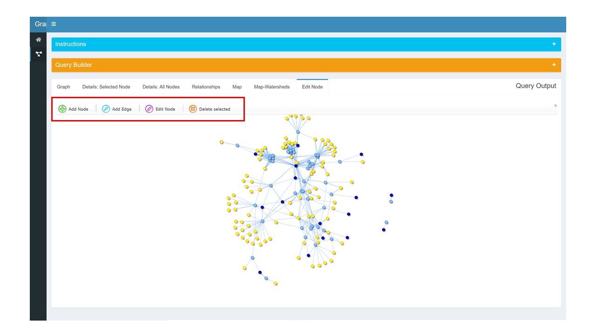

## Overview   
The *graphishui* is a user interface providing access to the PSS-KG database housed in an instance of neo4j. The purpose of the UI is to demonstrate that a tool can be developed that gives non-technical users access to the the graph providing a means of discovering connections and answering questions.

The UI was developed as a <a href="https://shiny.rstudio.com/" target="_blank">Shiny app</a>.

## Running/Stopping the Docker Container for the UI   

1. Navigate to the `graphish` folder.  
2. Start the ui: `docker-compose up -d --build ui` (may take 15-20 minutes the first time)
3. Stop the ui: `docker-compose down`
       
## Navigating the User Interface  

1. The opening (`Home`) screen will display, in a production version, information personalized to the user. In this proof-of-concept (PoC) version, it serves as a placeholder.   
2. Click on the `Graph` icon (red arrow in above image) in the side panel to access the data query/exploration tools. Note that the side-bar, Instructions, and Query Builder can be minimized to provide more room for query output.   
3. The query builder is designed to let the user explore relationships between two node types. The dropdown menus provide a list of all available node labels and relationships that exist in the PSS-KG database. Additionally, *r* is given as an option in the relationship column and, if chosen, queries for all relationships between the two selected nodes.   
4. With desired nodes and relationship selected, press the `run query` button. Note that queries take time to run, and those returning many nodes take time to display. In this POC, there is no "spinner" indicating that the query is running, so patience is encouraged. (After the first query, the display will dim for subsequent queries, indicating that it is running.) In testing, most results were displayed in less than 5 seconds.    
5. If the query produces results, a graph of the results will appear (assuming the user is in the `Graph` tab). Clicking on a node produces a table below the graph and a spatial-data indicator. The table contains all the properties of the node and the spatial indicator lets you know if there is spatial information associated with the node. The intention of the table is to provide the user with quick information as they click through the graph, but truncates cells with long entries. To see truncated properties in full, click on the `Details: Selected Node` tab.     
6. While the `Details: Selected Node` tab shows properties of a single node, the `Details: All Nodes` shows the properties of all nodes returned by the query. Both contain column filters and a global search box to help the user focus their search. The `Relationships` table works in the same way.   
7. The `Map` tab displays all nodes with spatial information and will highlight the node currently selected. You can change the base map using the "layer selector" in the top-right corner of the map. (The `Map` tab has one annoyance: If you click on a node containing spatial data before clicking on the map tab for the first time, the node will not be indicated by a marker icon (just a red circle like the other nodes). To see the marker you must click on the map tab first. This only affects the first node. ).    
8. The `Map-Watersheds` tab is not connected to the database nor related to the query, but was included to demonstrate that the UI can handle polygon spatial data.  
9. The `Edit Node` tab is not connected to the database, but does display the graph produced by the query. Its purpose is to demonstrate a possible interface letting users add nodes or update existing nodes. Clicking the `Edit` button shows buttons for adding a node or edge. If you click on an existing node first, options for editing or deleting a node appear as well. 

